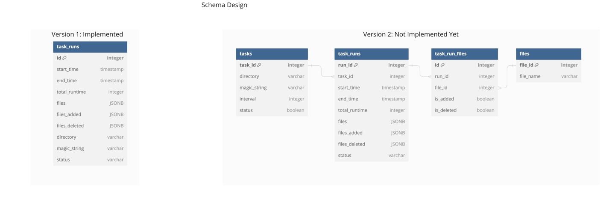

# DirWatcher

This project was generated using fastapi_template.

## Schema Design


## Basic Over View of Routes


<table>
<tr>
<td> Route </td> <td> Method </td> <td> Body </td> <td> Response </td> <td> Status </td> <td> Description </td>
</tr>

<tr>
<td> /api/task/config </td> 
<td> PUT </td>
<td>

```json
{
    "directory": "sample_directory", 
    "interval": 20, 
    "magic_string": "testing"
}
```
</td>
<td>

```json
{
    "message": "Configuration updated successfully"
}
```
</td>
<td> 200 </td> 
<td> Updates the configurations for the dir watcher which includes directory, interval, magic string  </td>
</tr>


<tr>
<td> /api/task/run?offset=0&limit=2&directory=sample_directory&magic_string=testing </td> 
<td> GET </td>
<td>NA</td>
<td>

```json
[
    {
        "total_runtime": 0,
        "id": 181,
        "files_added": [],
        "directory": "sample_directory",
        "status": "Success",
        "start_time": "2024-01-30T01:14:02.600330+00:00",
        "end_time": "2024-01-30T01:14:02.657353+00:00",
        "files": [
          "file2",
          "file1"
        ],
        "files_deleted": [],
        "magic_string_count": 2,
        "magic_string": "testing"
    },
    {
        "total_runtime": 0,
        "id": 186,
        "files_added": [],
        "directory": "sample_directory",
        "status": "Success",
        "start_time": "2024-01-30T01:16:05.573536+00:00",
        "end_time": "2024-01-30T01:16:05.697022+00:00",
        "files": [
          "file2",
          "file1"
        ],
        "files_deleted": [],
        "magic_string_count": 2,
        "magic_string": "testing"
    }
]
```
</td>
<td> 200 </td> 
<td> Fetches the paginated Runs based on the provided directory and magic string </td>
</tr>


<tr>
<td> api/task/latest_run?directory=sample_directory&ignore_directory=false </td> 
<td> GET </td>
<td>NA</td>
<td>

```json
{
    "total_runtime": 0,
    "id": 287,
    "files_added": [],
    "directory": "sample_directory",
    "status": "Success",
    "start_time": "2024-01-30T02:42:55.931954+00:00",
    "end_time": "2024-01-30T02:42:55.937672+00:00",
    "files": [
    "file2",
    "file1"
    ],
    "files_deleted": [],
    "magic_string_count": 2,
    "magic_string": "testing"
}
```
</td>
<td> 200 </td> 
<td> Updates the configurations for the dir watcher which includes directory, interval, magic string  </td>
</tr>


<tr>
<td> /api/task/start </td> 
<td> POST </td>
<td></td>
<td>

```json
{
    "message": "Task started successfully"
}
```
</td>
<td> 200 </td> 
<td> Started Running task with the existing configurations </td>
</tr>


<tr>
<td> /api/task/start </td> 
<td> POST </td>
<td></td>
<td>

```json
{
    "detail": "Task is already running"
}
```
</td>
<td> 400 </td> 
<td> Cannot Run task as the task is already running </td>
</tr>


<tr>
<td> /api/task/stop </td> 
<td> DELETE </td>
<td></td>
<td>

```json
{
    "message": "Task stopped successfully"
}
```
</td>
<td> 200 </td> 
<td> Stopped task successfully </td>
</tr>


<tr>
<td> /api/task/stop </td> 
<td> DELETE </td>
<td></td>
<td>

```json
{
    "detail": "Task is not running"
}
```
</td>
<td> 400 </td> 
<td> Cannot stop task as it is not running already</td>
</tr>


</table>

## Poetry

This project uses poetry. It's a modern dependency management
tool.

To run the project use this set of commands:

```bash
poetry install
poetry run python -m DirWatcher
```

This will start the server on the configured host.

You can find swagger documentation at `/api/docs`.

You can read more about poetry here: https://python-poetry.org/

## Docker

You can start the project with docker using this command:

```bash
docker-compose -f deploy/docker-compose.yml --project-directory . up --build
```

If you want to develop in docker with autoreload add `-f deploy/docker-compose.dev.yml` to your docker command.
Like this:

```bash
docker-compose -f deploy/docker-compose.yml -f deploy/docker-compose.dev.yml --project-directory . up --build
```

This command exposes the web application on port 8000, mounts current directory and enables autoreload.

But you have to rebuild image every time you modify `poetry.lock` or `pyproject.toml` with this command:

```bash
docker-compose -f deploy/docker-compose.yml --project-directory . build
```

## Project structure

```bash
$ tree "DirWatcher"
DirWatcher
├── conftest.py  # Fixtures for all tests.
├── db  # module contains db configurations
│   ├── dao  # Data Access Objects. Contains different classes to interact with database.
│   └── models  # Package contains different models for ORMs.
├── __main__.py  # Startup script. Starts uvicorn.
├── services  # Package for different external services such as rabbit or redis etc.
├── settings.py  # Main configuration settings for project.
├── static  # Static content.
├── tasks  # Folder containing the background task for monitoring directories
├── tests  # Tests for project.
└── web  # Package contains web server. Handlers, startup config.
    ├── api  # Package with all handlers.
    │   └── router.py  # Main router.
    ├── application.py  # FastAPI application configuration.
    └── lifetime.py  # Contains actions to perform on startup and shutdown.
```

## Configuration

This application can be configured with environment variables.

You can create `.env` file in the root directory and place all
environment variables here.

All environment variables should start with "DIRWATCHER_" prefix.

For example if you see in your "DirWatcher/settings.py" a variable named like
`random_parameter`, you should provide the "DIRWATCHER_RANDOM_PARAMETER"
variable to configure the value. This behaviour can be changed by overriding `env_prefix` property
in `DirWatcher.settings.Settings.Config`.

An example of .env file:
```bash
DIRWATCHER_RELOAD="True"
DIRWATCHER_PORT="8000"
DIRWATCHER_ENVIRONMENT="dev"

DIRWATCHER_DIRECTORY=sample_directory
DIRWATCHER_MAGIC_STRING=testing
DIRWATCHER_INTERVAL=30
DIRWATCHER_TASK_RUNNING=true
```

You can read more about BaseSettings class here: https://pydantic-docs.helpmanual.io/usage/settings/

## Pre-commit

To install pre-commit simply run inside the shell:
```bash
pre-commit install
```

pre-commit is very useful to check your code before publishing it.
It's configured using .pre-commit-config.yaml file.

By default it runs:
* black (formats your code);
* mypy (validates types);
* isort (sorts imports in all files);
* flake8 (spots possible bugs);


You can read more about pre-commit here: https://pre-commit.com/

## Migrations

If you want to migrate your database, you should run following commands:
```bash
# To run all migrations until the migration with revision_id.
alembic upgrade "<revision_id>"

# To perform all pending migrations.
alembic upgrade "head"
```

### Reverting migrations

If you want to revert migrations, you should run:
```bash
# revert all migrations up to: revision_id.
alembic downgrade <revision_id>

# Revert everything.
alembic downgrade base
```

### Migration generation

To generate migrations you should run:
```bash
# For automatic change detection.
alembic revision --autogenerate

# For empty file generation.
alembic revision
```


## Running tests

If you want to run it in docker, simply run:

```bash
docker-compose -f deploy/docker-compose.yml -f deploy/docker-compose.dev.yml --project-directory . run --build --rm api pytest -vv .
docker-compose -f deploy/docker-compose.yml -f deploy/docker-compose.dev.yml --project-directory . down
```

For running tests on your local machine.
1. you need to start a database.

I prefer doing it with docker:
```
docker run -p "5432:5432" -e "POSTGRES_PASSWORD=DirWatcher" -e "POSTGRES_USER=DirWatcher" -e "POSTGRES_DB=DirWatcher" postgres:13.8-bullseye
```


2. Run the pytest.
```bash
pytest -vv .
```
